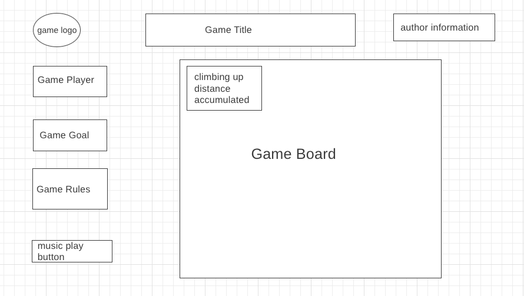

# The Climbing Game

# Background

The Climbing game is similar to Doodle Jump. It enables you to choose from 3 characters as a player as he/she climbs up a mountain through a series of rocks. You must avoid the hazards that get in your way(e.g. avalanche, broken rocks, or a dragon breathing fire to you etc. ) to prevent yourself from falling off the rocks. The background of the game board will also dynamically change as you climb your way up to the mountain. It will be sunny initially and start raining when the dragon comes to the place, and if you can summit, you win. Meanwhile, you will still get scored with the numbers of rocks you passed.

# Functionality & MVPs

In the climbing game, users will be able to:

- pick a character and start the game
- use the left/right keyboard to control the climbing direction and reach the rocks to avoid falling off
- see a moving background as they climb all the way up
- accumulate their scores by passing more rock

In addition, this project will include:

- An **About** modal describing the background and rules of the game
- A production README

# Wireframes

- Instruction on the upper left include the background and rules of the game.
- Rock count keeps track of the number of rocks the player accumulates.
- In the top middle , there will be clickable music play button.
- On the right, there will be Author information including links to this project's Github repo, my LinkedIn and AngelList.
- On the left, three clickable characters will be presented for users to pick as different characters have different climbing speed and different motion types. (Bonus)
- Additionally, a drop-down will be added to pick a theme for different rule sets (Bonus).

# Technologies, Libraries, APIs

I am planning to use the native browser technology, Canvas API to render the background of the game as well as the characters, all the motions involved.

# Implementation Timeline

- **Friday Afternoon & Weekend**: Setup project, including getting webpack up and running. Get moving canvas to show up on the screen, and spend time getting comfortable with the Canvas API. Create `Rock` and individual `Character`, `Dragon`and `BrokenRock` classes. Get a character rendered to the canvas reflecting the climbing motion during the game.
- **Monday**: Dedicate this day toward implementing the underlying logic of the game. Ensure that I can get the moving canvas work and the snow flacks/ fire-breathing dragon work appropriately. If time, make sure this is all rendered correctly on the canvas.
- **Tuesday**: If I didn't get to it already, get everything correctly rendered to the canvas. Make sure they re-render correctly when I restart the game. Then, focus on user controls: left, right arrows keyboard controls.
- **Wednesday**: Finish implementing user controls, and focus on styling, as well as implementing the different color schemes and nav links. If time, start on bonuses.
- **Thursday Morning**: Deploy to GitHub pages. If time, rewrite this proposal as a production README.

# Bonus features

There are many themes and characters with different climbing behaviors I can add on to the main game.

- More themes to choose from a drop down list
- Create different motion effect on different characters accordingly, rather than just a different images.
